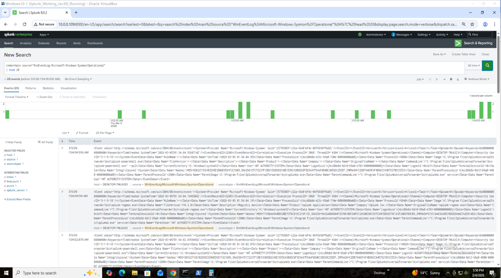
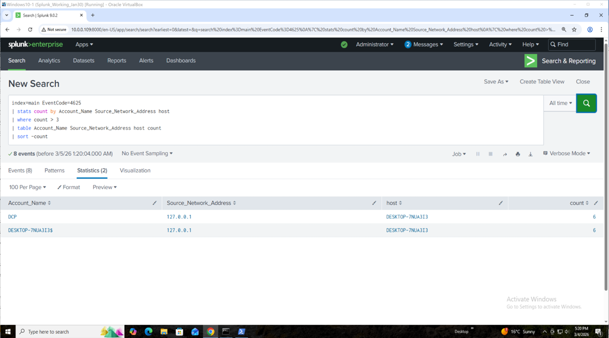
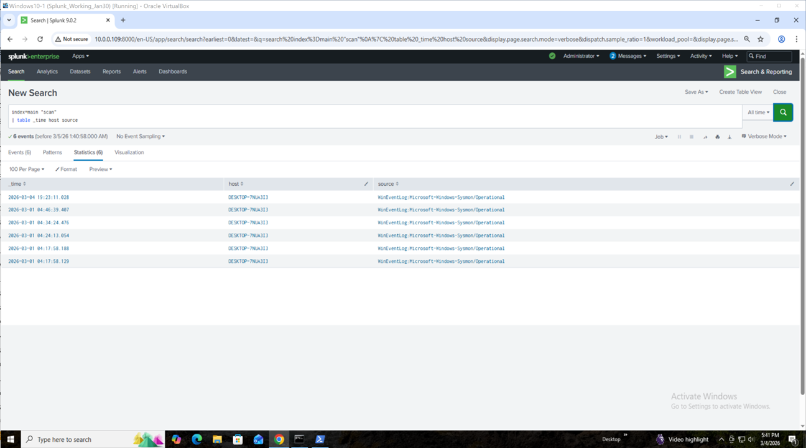
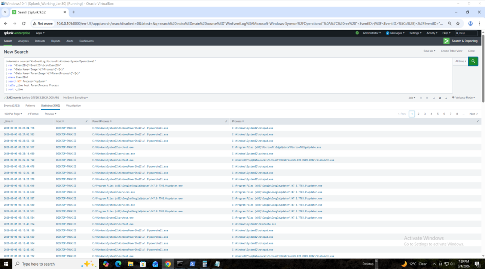
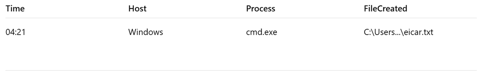
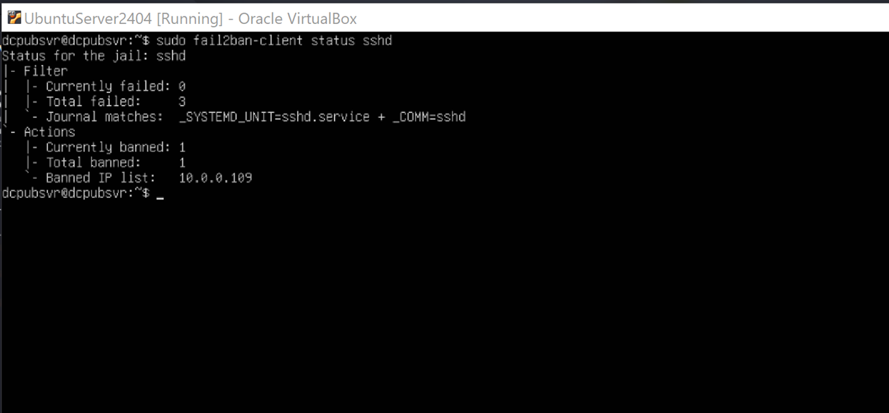

# SOC Detection Engineering Lab – Splunk SIEM Telemetry Pipeline

## Executive Summary

This project demonstrates the design and implementation of a **Security
Operations Center (SOC) lab** used to simulate real-world cyber attacks,
ingest telemetry, build detection rules, investigate incidents, and
implement automated defense using **Splunk SIEM**.

The lab integrates Windows endpoint telemetry, Linux authentication
logs, and simulated attacker activity to demonstrate detection
engineering and SOC investigation workflows aligned with the **MITRE
ATT&CK framework**.

Key achievements:

-   Built a complete telemetry pipeline using Splunk Universal Forwarder
-   Indexed **38,000+ security events**
-   Simulated multiple attack techniques
-   Developed detection rules using **Splunk SPL**
-   Created SOC alerts and dashboards
-   Conducted incident investigation workflows
-   Implemented automated containment using **Fail2Ban**
-   Developed **Sigma detection rules**
-   Performed threat hunting queries
-   Documented a SOC incident report

------------------------------------------------------------------------

# 1. Project Overview

This project replicates a small SOC environment where logs from Windows
and Linux systems are centralized into Splunk for analysis.

Objectives:

-   Understand SIEM architecture
-   Build a telemetry pipeline
-   Simulate attacker behavior
-   Create detection queries
-   Investigate security alerts
-   Map attacks to MITRE ATT&CK

Focus areas:

-  SIEM Engineering
-  Log Ingestion
-  Detection Engineering
-  Threat Simulation
-  Incident Investigation
-  Automated Response

------------------------------------------------------------------------

# 2. Lab Architecture

The SOC lab consists of four virtual machines.

-  **Windows 10 Endpoint:** Generates telemetry using Windows logs and Sysmon.

-  **Ubuntu Splunk Server:** Acts as Splunk **Indexer + Search Head**.

-  **Linux System Logs:** Provides SSH authentication telemetry.

-  **Kali Linux:** Used to simulate attacker behavior.

## Architecture Diagram


The SOC lab architecture centralizes endpoint and authentication logs into Splunk for analysis.

Windows endpoints generate telemetry through Sysmon and Windows Security logs.  
Linux authentication events are collected from auth.log.

Logs are forwarded to the Splunk Indexer using Splunk Universal Forwarder over TCP port 9997.

SOC analysts use Splunk dashboards and detection queries to identify malicious activity and investigate incidents.

## Data Flow

-  Kali Linux (Attacker) → Windows 10 Endpoint (Sysmon + Logs) → Splunk
-  Universal Forwarder → TCP Port 9997 → Splunk Indexer → SOC Analyst
Investigation

------------------------------------------------------------------------

# 3. Telemetry Sources

## Windows Security Logs

EventID 4624 --- Successful Logon\
EventID 4625 --- Failed Logon

## Sysmon Logs

EventID 1 --- Process Creation\
EventID 3 --- Network Connection\
EventID 11 --- File Creation

## Linux Logs

/var/log/auth.log --- SSH authentication logs

## Network Activity

-  Nmap scan activity\
-  Outbound network connections

------------------------------------------------------------------------

# 4. Tools & Environment

-  **SIEM:** Splunk Enterprise (Ubuntu)

-  **Endpoint Monitoring:** Microsoft Sysmon

-  **Log Forwarding:** Splunk Universal Forwarder

-  **Virtualization:** Oracle VM VirtualBox

-  **Attack Simulation:** Kali Linux

-  **Automated Defense:** Fail2Ban

------------------------------------------------------------------------

# 5. Repository Structure

-  architecture
-  detections
-  sigma-rules
-  threat-hunting
-  screenshots
-  reports
-  README.md

------------------------------------------------------------------------

# 6. Environment Setup

### Virtual Machines

**Windows 10**
RAM: 4GB\
Disk: 60GB

**Ubuntu Splunk Server**
RAM: 2GB\
Disk: 30GB

**Kali Linux**
RAM: 2GB\
Disk: 30GB

### Network Setup

Adapter 1 --- NAT (internet access)

Adapter 2 --- Host-Only network (internal attack lab)

------------------------------------------------------------------------

# 7. Log Collection Pipeline

**Windows Logs Forwarded:**

- **Security Logs**\
- **System Logs**\
- **Sysmon Operational Logs**

**Linux Logs Forwarded:**

/var/log/auth.log\
/var/log/syslog

**Splunk Index Used:**
```
index=main
```
**Screenshot**


**Log Collection Pipeline Verification**
Sysmon Telemetry Ingestion

To verify that endpoint telemetry was successfully forwarded to Splunk, a search was performed for Sysmon operational logs.

**Splunk Query**
```
index=main source="WinEventLog:Microsoft-Windows-Sysmon/Operational"
| head 20
```
**Explanation**

This query retrieves recent Sysmon events indexed in Splunk, confirming that the Splunk Universal Forwarder on the Windows endpoint is successfully sending security telemetry to the Splunk server.

**Evidence**


------------------------------------------------------------------------

# 8. Detection Strategy

The detection strategy focuses on identifying attacker behaviors mapped
to MITRE ATT&CK.

### Primary attacker tactics monitored:

-  **Credential Access**
-  **Execution**
-  **Discovery**

Detection rules were validated using simulated attack activity.

------------------------------------------------------------------------

# 9. Attack Simulations

### Attack 1 --- SSH Brute Force

**Attack Command**
```
for i in {1..10}; do ssh attacker@localhost -p 22 "exit"; done
```
**Log Source**

Linux auth.log

**Detection Query**
```
index=main sourcetype="linux_secure" "Failed password"
| rex "Failed password for (invalid user )?(?<user>\w+) from (?<src_ip>\d+\.\d+\.\d+\.\d+)"
| stats count by user src_ip
| where count > 5
| table user src_ip count
| sort -count
```
**MITRE ATT&CK**

**Tactic: Credential Access**\
**Technique: Brute Force**\
**ID: T1110**

**Detection Result**

This query identifies IP addresses performing multiple failed login attempts, indicating a potential brute-force attack.

**Screenshot**


------------------------------------------------------------------------

### Attack 2 --- Windows Credential Attack

**Log Source**

Windows Security Logs

**Detection Query**
```
index=main EventCode=4625
| stats count by Account_Name Source_Network_Address
| sort -count
```
**MITRE ATT&CK**

**Tactic: Credential Access**\
**Technique: Brute Force**\
**ID: T1110**

**Screenshot**



------------------------------------------------------------------------

### Attack 3 --- Port Scan Detection

**Attack Command**
```
nmap -sS `<target-ip>`{=html}
```
**Detection Query**
```
index=main EventID=3
| stats count by DestinationPort SourceIp
| sort -count
```
**MITRE ATT&CK**

**Tactic: Discovery**\
**Technique: Network Service Discovery**\
**ID: T1046**

**Screenshot**



------------------------------------------------------------------------

### Attack 4 --- Encoded PowerShell Execution

**Attack Command**
```
powershell -EncodedCommand
UwB0AGEAcgB0AC0AUAByAG8AYwBlAHMAcwAgAGMAYQBsAGMALgBlAHgAZQA=
```
**Detection Query**
```
index=main  "*EncodedCommand*"
| rex "<EventID>(?<EventID>\d+)</EventID>"
| search EventID=1

or

index=main  "*EncodedCommand*"
| rex "<EventID>(?<EventID>\d+)</EventID>"
| search EventID=1
| stats count by EventId
```
**MITRE ATT&CK**

**Tactic: Execution**\
**Technique: PowerShell**\
**ID: T1059.001**

**Screenshot**


------------------------------------------------------------------------

### Attack 5 --- Suspicious Process Execution

**Scenario**

PowerShell spawning calc.exe

**Detection Query**
```
index=main source="WinEventLog:Microsoft-Windows-Sysmon/Operational"
| rex "<EventID>(?<EventID>\d+)</EventID>"
| rex "<Data Name='Image'>(?<Process>[^<]+)"
| rex "<Data Name='ParentImage'>(?<ParentProcess>[^<]+)"
| where EventID=1
| search NOT Process="*splunk*"
| table _time host ParentProcess Process
| sort -_time
```
**MITRE ATT&CK**

**Tactic: Execution**\
**Technique: Command Interpreter**\
**ID: T1059**

**Screenshot**



------------------------------------------------------------------------

### Attack 6 --- Malware Execution (Safe Simulation)

**Scenario**

A safe malware simulation was performed using the EICAR test file. The EICAR string is a standardized antivirus test file used to safely simulate malware detection without causing harm to the system.

**Attack Command (Windows Endpoint)**
```
echo X5O!P%@AP[4\PZX54(P^)7CC)7}$EICAR-STANDARD-ANTIVIRUS-TEST-FILE! > eicar.txt
```
**Telemetry Generated**

Sysmon logs captured the activity including:

EventID 1 --- Process Creation  
EventID 11 --- File Creation

**Detection Query**
```
index=main source="WinEventLog:Microsoft-Windows-Sysmon/Operational"
| rex "<EventID>(?<EventID>\d+)</EventID>"
| rex "<Data Name='Image'>(?<Process>[^<]+)"
| rex "<Data Name='TargetFilename'>(?<FileCreated>[^<]+)"
| search EventID=11
| search FileCreated="*eicar*"
| table _time host Process FileCreated
| sort -_time
```
**MITRE ATT&CK**

**Tactic: Execution**\  
**Technique: User Execution**\  
**ID: T1204**

**Detection Result**

The query detects creation of files containing the EICAR test string, demonstrating how SOC analysts can identify suspicious file creation activity associated with potential malware execution.

**Screenshots**


------------------------------------------------------------------------

# 10. Detection Engineering

### Detection rules created:

**SSH brute force detection**\
**Windows credential attack detection**\
**Encoded PowerShell detection**\
**Port scan detection**\
**Suspicious process execution detection**

### Each detection includes:

-  **Detection logic**\
-  **SPL query**\
-  **MITRE mapping**\
-  **False positive considerations**

### False Positive Considerations

Some legitimate system processes may trigger detections, including:

• Windows update processes\
• Scheduled administrative scripts\
• Splunk Universal Forwarder processes

Detection queries were tuned to exclude known benign processes such as:

Process="*splunk*"

Further tuning may be required in production environments.

------------------------------------------------------------------------

# 11. Sigma Detection Rules

Sigma is a platform‑agnostic detection rule format used to share
detection logic across SIEM platforms.

**Example Sigma rule:**

``` yaml
title: Suspicious Encoded PowerShell Execution
logsource:
  product: windows
  service: sysmon

detection:
  selection:
    EventID: 1
    Image|endswith: '\powershell.exe'
    CommandLine|contains:
      - '-EncodedCommand'
      - '-enc'

condition: selection
level: high
```

**Stored in repository:**

sigma-rules/encoded_powershell.yml

------------------------------------------------------------------------

# 12. Alert Engineering

**Example Alert**

**Alert Name:** SSH Brute Force Detection

**Trigger Condition**

More than 5 failed attempts in 1 minute.

**Schedule****

Every 1 minute

**Severity**

Medium


#### SOC Alert Example

**Example Alert:** Windows Brute Force Attempt

**Detection Query**
```
index=main EventCode=4625
| stats count by Account_Name Source_Network_Address
| where count > 3
| sort -count
```
**Alert Logic**

If more than 3 failed login attempts are detected from a single IP address,
an alert is triggered for SOC investigation.

**Severity**

Medium

**SOC Response**

1. Verify source IP address
2. Check additional login attempts
3. Investigate user account activity
4. Block IP if malicious
------------------------------------------------------------------------

# 13. Visualization

### Splunk dashboards visualize attack patterns.

**Examples:**

**Brute force attack timeline**
**Top targeted users**
**Top source IP addresses**

**Splunk Dashboard**

SOC Security Monitoring Dashboard displaying
The SOC Security Monitoring Dashboard provides visibility into key security events.

**Dashboard panels include:**

• Failed Windows login attempts  
• Process execution telemetry from Sysmon  
• Security event timeline visualization  

These visualizations allow SOC analysts to quickly identify abnormal activity and investigate potential attacks.

**Screenshot**


------------------------------------------------------------------------

# 14. Threat Hunting Queries

**Example Hunting Query --- Most Frequent Processes**
```
index=main EventID=1 \| stats count by Image \| sort -count
```
**Example --- Suspicious PowerShell Activity**
```
index=main Image="\*powershell.exe" \| stats count by CommandLine
```
**Threat hunting queries stored in:**

threat-hunting/

------------------------------------------------------------------------

# 15. MITRE ATT&CK Mapping

The simulated attacks and detections in this lab were mapped to the MITRE ATT&CK framework.

| Attack | Technique | MITRE ID |
|------|------|------|
| SSH Brute Force | Brute Force | T1110 |
| Windows Logon Failure | Credential Access | T1110 |
| Encoded PowerShell Execution | PowerShell | T1059.001 |
| Port Scan | Network Service Discovery | T1046 |
| Suspicious Process Execution | Command Interpreter | T1059 |

These mappings demonstrate how attacker behaviors observed in the lab align with real-world adversary techniques documented in the MITRE ATT&CK framework.
------------------------------------------------------------------------

# 16. SOC Investigation Workflow

**Example workflow**

Alert triggered → SOC analyst reviews logs → Process tree analysis →
Timeline reconstruction → MITRE ATT&CK mapping → Incident documentation

### Example Process Tree Investigation

Process creation events from Sysmon were analyzed to identify suspicious execution chains.

cmd.exe\
→ powershell.exe\
→ calc.exe

**Splunk Query**

```
index=main
| rex "<EventID>(?<EventID>\d+)</EventID>"
| rex "<Data Name='Image'>(?<Process>[^<]+)"
| rex "<Data Name='ParentImage'>(?<ParentProcess>[^<]+)"
| search EventID=1
| table _time host ParentProcess Process
| sort -_time
```

**Screenshot**


------------------------------------------------------------------------

# 17. SOC Incident Report

**Incident Name**

Encoded PowerShell Execution

**Host**

Windows Endpoint

**Detection**
```
index=main EventID=1 "*EncodedCommand*"
```
**Process Chain**

cmd.exe\
→ powershell.exe\
→ calc.exe

**MITRE ATT&CK**

T1059.001

**Conclusion**

Suspicious PowerShell command execution detected and investigated.

**Full report located in**

reports/powershell_incident_report.md

------------------------------------------------------------------------

# 18. Automated Defense --- Fail2Ban

Fail2Ban monitors authentication logs and blocks brute‑force attackers.

**Configuration**
```
/etc/fail2ban/jail.local
```
**Settings**
```
maxretry = 3\
bantime = 1h
```
**Screenshot**




------------------------------------------------------------------------

# 19. Troubleshooting

**Issue**

Logs not appearing in Splunk.

**Root Cause**

inputs.conf had a hidden .txt extension.

**Resolution**

Corrected configuration and restarted forwarder.

**Result**

38,000+ events successfully indexed.

------------------------------------------------------------------------

# 20. SOC Metrics

-  Events indexed: 38,000+
-  Data sources: 4
-  Detection rules created: 5
-  Attack simulations executed: 5
-  Alert response time: \<1 minute

------------------------------------------------------------------------

# 21. Lessons Learned

-  Importance of Sysmon configuration
-  Challenges with SIEM log ingestion
-  Detection tuning to reduce false positives
-  Correlation of logs across multiple systems

------------------------------------------------------------------------

# 22. Skills Demonstrated

-  SIEM Engineering
-  Log Pipeline Troubleshooting
-  Detection Engineering
-  Threat Simulation
-  Security Log Analysis
-  SOC Investigation Workflow
-  Endpoint Telemetry Analysis

------------------------------------------------------------------------

## Future Improvements

Possible enhancements to this SOC lab include:

• Integrating threat intelligence feeds
• Automating detection using SOAR workflows
• Adding ransomware detection scenarios
• Implementing Active Directory attack simulations
• Expanding Sigma rule coverage

These improvements would further enhance the detection and response capabilities of the lab environment.
